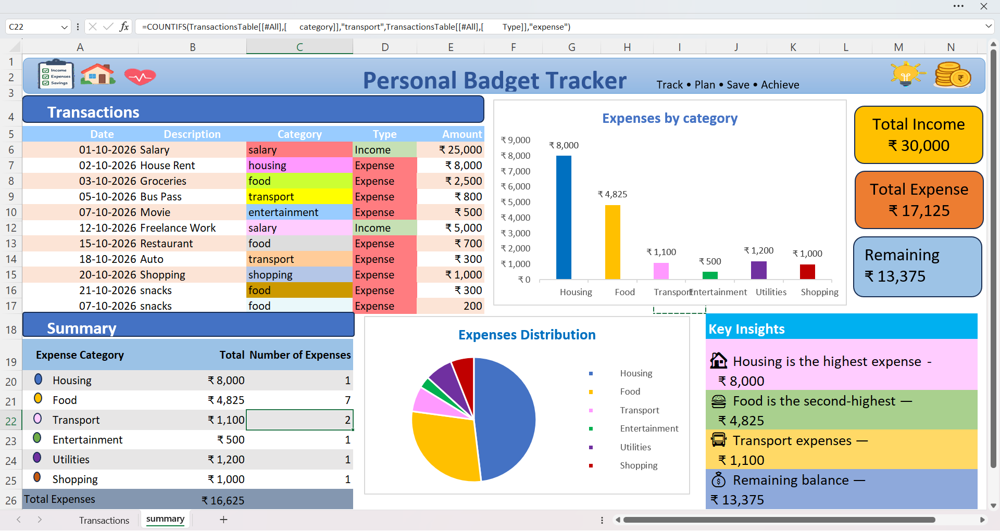
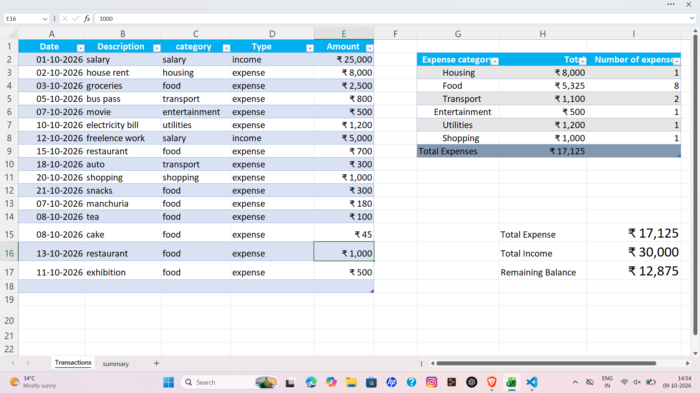

📊 '''Personal Budget Tracker | Excel Dashboard'''

An Excel-based data analytics project designed to track income, monitor expenses, and understand personal spending patterns through a visual dashboard.

The project transforms transaction records into meaningful financial summaries using Excel formulas, KPI cards, and charts.

📸 '''Dashboard Preview'''

🧾 Transactions Sheet

The Transactions sheet contains the raw data used for analysis, including the date, description, category, transaction type, and amount.

✨ Key Features

- Income Tracking — Calculate total income from recorded transactions.
- Expense Analysis — Monitor expenses across different categories.
- Balance Overview — Calculate the remaining balance after expenses.
- Category-wise Breakdown — Understand how expenses are distributed.
- Visual Dashboard — Present key financial metrics through KPI cards and charts.
- Automated Calculations — Use Excel formulas to update summaries when the underlying data changes.
- Spending Insights — Make spending patterns easier to identify from the dashboard.

📈 Key Performance Indicators

KPI| What It Shows
Total Income| Total money received
Total Expenses| Total money spent
Remaining Balance| Income minus expenses

🛠️ Tools & Techniques

Tool / Technique| Application
Microsoft Excel| Data organization and dashboard development
"SUMIF"| Calculate totals based on transaction type or category
"COUNTIF"| Count records matching a condition
Excel Charts| Visualize expense distribution
Conditional Formatting| Improve readability and highlight key values
KPI Cards| Display important financial metrics

🔄 Project Workflow

Step 1 — Data Entry: Record income and expense transactions.

Step 2 — Data Organization: Structure the records by date, category, and transaction type.

Step 3 — Data Analysis: Apply Excel formulas to calculate income, expenses, and category totals.

Step 4 — Visualization: Present the results through charts and KPI cards.

Step 5 — Interpretation: Review the dashboard to understand spending patterns and the remaining balance.

💡 Questions This Dashboard Helps Answer

- How much income was recorded?
- How much money was spent?
- How much balance remains?
- Which categories account for the expenses?
- How can spending patterns be reviewed more clearly?

📂 Project Structure

Personal Budget Tracker/
│
├── dashboard-preview.png
├── transactions-preview.png
│
├── documentation/
│   └── formulas.md
│
└── README.md

🎯 Project Objective

The objective of this project is to apply Excel data analysis techniques to everyday financial data and build a dashboard that makes financial information easier to understand.

📚 Learning Outcomes

- Organizing structured data for analysis.
- Applying conditional formulas in Excel.
- Calculating financial KPIs.
- Creating charts and dashboard layouts.
- Presenting numerical information in a clear visual format.

🚀 Future Improvements

- Monthly income and expense comparisons.
- Budget-versus-actual analysis.
- Savings goal tracking.
- Interactive filters for categories and dates.
- Additional insights into spending trends.

---

Project Category: Data Analytics
Domain: Personal Finance
Tool: Microsoft Excel